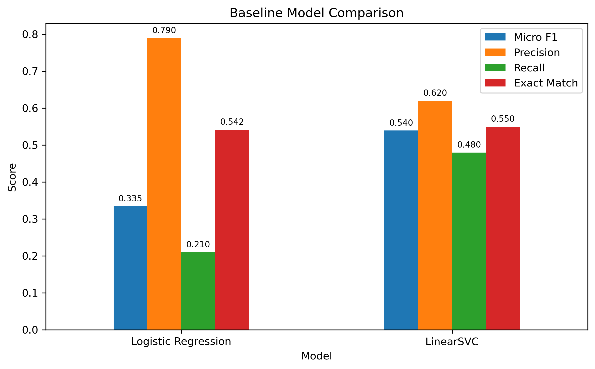

# Musinsa Review Complaint Detection

한국 패션 이커머스 리뷰를 대상으로 다중 라벨(Multi-label) 불만 유형 분류를 수행하는 텍스트 마이닝 프로젝트입니다.

본 프로젝트에서는 LLM(Qwen)을 활용하여 생성한 Silver Set을 학습 데이터로 사용하고, 사람이 직접 라벨링한 Gold Set을 평가 데이터로 사용하여 불만 유형 분류 모델을 구축합니다.

## 프로젝트 개요

* 도메인: Musinsa 상품 리뷰
    Crawler: [musinsa_crawler](https://github.com/riex71/musinsa_crawler)
* 학습 데이터: Silver Set (30,000개)
* 평가 데이터: Gold Set (500개)
* 입력 데이터: `content_norm`
* 분류 방식: Multi-label Classification
* 평가 지표:

  * Micro F1-score
  * Precision / Recall
  * Exact Match Ratio

## 라벨 체계

### Coarse Labels

* delivery
* packaging
* size_fit
* quality
* fabric_comfort
* color_design
* price
* other_complaint_coarse

### Fine Labels

#### delivery

* late_delivery
* wrong_item
* missing_item
* damaged_on_arrival

#### size_fit

* size_large
* size_small
* fit_dissatisfaction

#### quality

* finish_defect
* durability
* contamination

#### fabric_comfort

* fabric_issue
* thickness
* poor_comfort

#### color_design

* color_mismatch
* design_mismatch

#### price

* price_dissatisfaction

#### other_complaint

* other_complaint

## 프로젝트 구조

```text
musinsa-review-complaint-detection
│
├── data/
│   ├── silver_set.csv
│   └── gold_set.csv
│
├── baseline/
│   └── baseline_experiments.ipynb
│
├── outputs/
│   
└── README.md
```

## Baseline Models

### 1. TF-IDF + Logistic Regression

* TF-IDF 벡터화
* One-vs-Rest Logistic Regression 적용

### 2. TF-IDF + LinearSVC

* TF-IDF 벡터화
* One-vs-Rest LinearSVC 적용

## 결과 요약

LinearSVC는 Logistic Regression 대비 Recall이 크게 향상되었으며, Micro F1-score가 0.33에서 0.54로 증가하였다.



TF-IDF 기반 베이스라인 모델 중에서는 LinearSVC가 가장 우수한 성능을 보여 최종 베이스라인 모델로 선정하였다.

## 향후 계획

* KoELECTRA 기반 Multi-label 분류 모델 구축
* KLUE-RoBERTa 기반 Multi-label 분류 모델 구축
* TAPT(Task-Adaptive Pretraining) 적용
* Ably / Zigzag 리뷰를 활용한 외부 평가 수행
